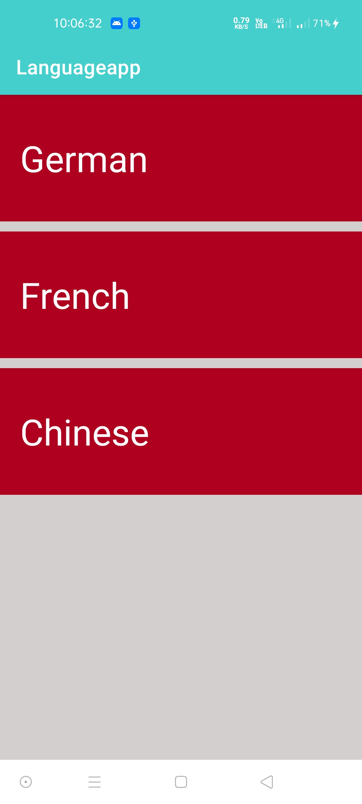
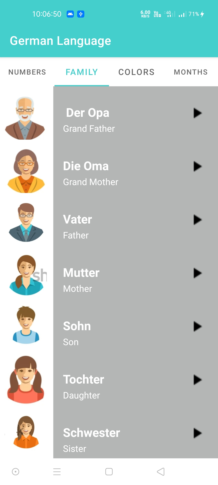
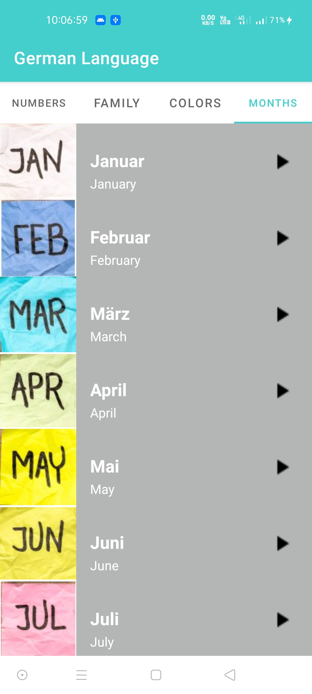
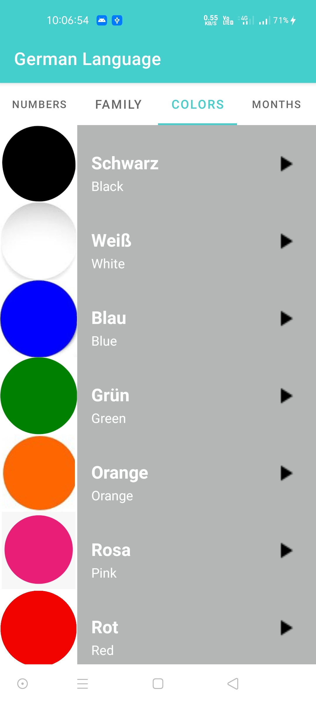
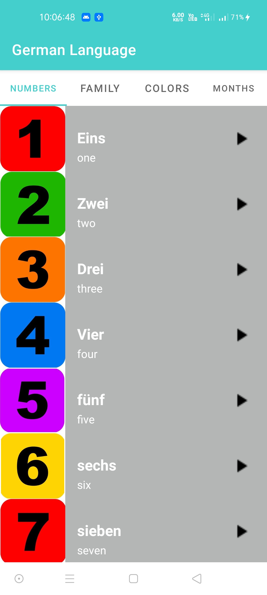

# Language_Translation-app

This is a small project which convert word of english to German,French,Chinese.

The app is for beginner who are learning new Language like German,French,Chinese, which translation English word to German ,French ,chinese in audio format

Model–view–viewmodel (MVVM) is a software architectural pattern used

    

     

